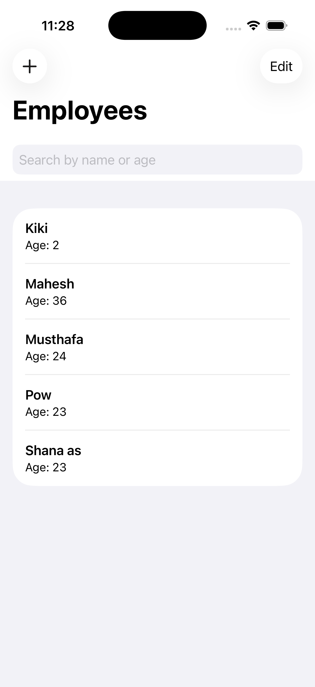
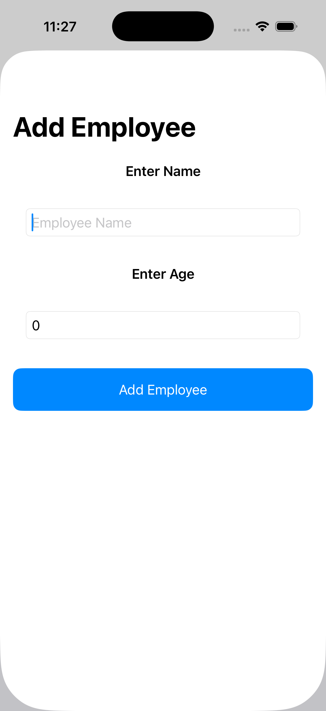
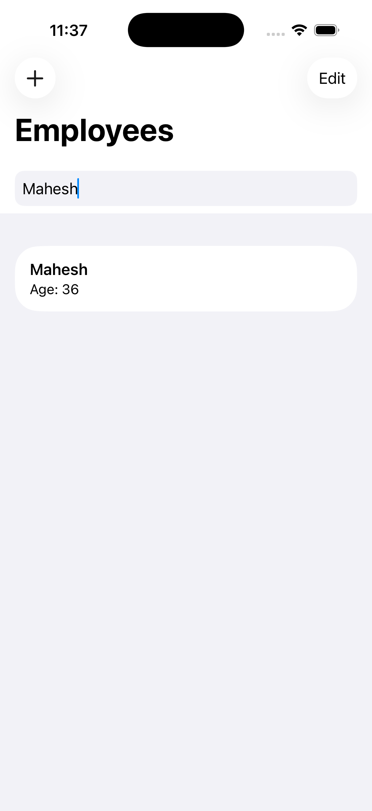

# 👥 Employee List App (SwiftUI + Core Data)

A simple iOS application built using **SwiftUI** and **Core Data** to manage employee details.  
Users can add, search, and delete employee records in a clean and intuitive interface.

---

## 🚀 Features

- **Add Employees** — Add employee details such as name and age using a form view.  
- **Search Functionality** — Instantly filter employees by name or age.  
- **Delete Employees** — Swipe to delete employee records.  
- **Core Data Integration** — Persistent local storage for all employee data.  
- **Modern SwiftUI Interface** — Minimal and responsive user experience.

---

## 🧩 Tech Stack

- **Language:** Swift  
- **Framework:** SwiftUI  
- **Database:** Core Data  
- **Architecture:** MVVM (with SwiftUI environment context)  
- **IDE:** Xcode 15+

---

## 📱 Screens

| Home Screen | Add Employee | Search Employee |
|--------------|---------------|----------------|
|  |  |  |

---

## 🏗️ Project Structure

```
EmployeeListApp/
│
├── EmployeeListAppApp.swift        # Entry point of the SwiftUI app
├── ContentView.swift               # Main employee list view
├── ListData.swift                  # Add new employee view (form)
├── Persistence.swift               # Core Data setup
├── Employee+CoreDataClass.swift    # Employee entity class
├── Employee+CoreDataProperties.swift # Employee entity properties
└── Assets.xcassets                 # App assets
```

---

## ⚙️ How to Run

1. Clone the repository  
   ```bash
   git clone https://github.com/yourusername/EmployeeListApp.git
   cd EmployeeListApp
   ```

2. Open the project in **Xcode**  
   ```bash
   open EmployeeListApp.xcodeproj
   ```

3. Build and run the app on **iPhone Simulator** or a **real device**.

---

## 🧠 Core Data Model

The app uses a Core Data entity named **Employee** with the following attributes:
- `empName`: String  
- `empAge`: Integer 64  

---

## 🔍 Key Functionalities (Code Overview)

### 1. Search Function
```swift
TextField("Search by name or age", text: $searchText)
```
Filters employees by name or age using:
```swift
employees.filter { emp in
    let matchesName = emp.empName?.localizedCaseInsensitiveContains(searchText) ?? false
    let matchesAge = Int64(searchText) == emp.empAge
    return matchesName || matchesAge
}
```

### 2. Add Employee (Modal Sheet)
```swift
.sheet(isPresented: $showingAddEmployee) {
    ListData().environment(\.\managedObjectContext, viewContext)
}
```

### 3. Delete Employee
```swift
.onDelete(perform: deleteEmployee)
```

---

## 🧾 Future Improvements

- ✅ Add more employee details (designation, salary, etc.)
- ✅ Add edit/update functionality  
- ✅ Implement sorting options  
- ✅ Add user authentication  
- ✅ Sync data with a cloud backend (e.g., Firebase or CloudKit)

---

## 🧑‍💻 Author

**Musthafa Labeeb K A**  
📍 MVoc Software Application Development, CUSAT  
💼 Flutter Developer Intern @ MACH10 Global Consultancy Pvt Ltd  
🔗 [GitHub Profile](https://github.com/yourusername)

---

## 🪪 License

This project is licensed under the **MIT License** — see the [LICENSE](LICENSE) file for details.

---
